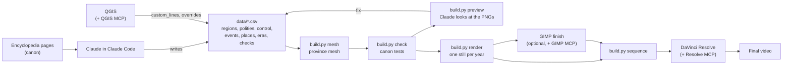

# Controglobe video studio

**"Alternate History of Arabia (in place of the United States)", every year from 500 BCE to 2026.**

This folder turns the Controglobe canon into a mapping video in the "X (in Y), every year"
style: one map per year on real coastlines, a year counter that never stops, era title cards,
short captions, music. Claude writes the history as data and drives the tools; Python draws
precise, topologically clean borders and renders every year; QGIS, GIMP and DaVinci Resolve
do the hands-on work, and Claude can operate all three through MCP servers.

It is separate from the encyclopedia: the site stays dependency-free, and nothing here is
loaded by any page. Generated files (`build/`, `output/`, `cache/`) are never committed.

## Transposition, not transplantation

| | Transplantation (the usual "X in place of Y") | Transposition (Controglobe) |
|---|---|---|
| What moves | The country: its land or its people are set down in Y's place | Only history: Arabia takes the United States' *role* |
| Coastline on screen | Y's, or X's shape pasted onto Y's location | Arabia's own, unchanged |
| Borders | Whatever X had, re-fitted | New, internal frontiers on wadis, rivers, escarpments |
| Names | X's | Arabian throughout: roles, not costumes |

What the viewer should feel is the rhyme:

| United States | Arabia in the Global Swap |
|---|---|
| Jamestown, 1607 | Red Sea Company settlement at Jeddah, 1607 |
| Georgia, the thirteenth colony, 1732 | Najd, chartered around Diriyah and Riyadh, 1732 |
| Declaration of Independence, 1776 | Declaration of 25 September 1776 |
| Treaty of Paris, frontier on the Mississippi, 1783 | Treaty of Zafar, frontier on the Euphrates, 1783 |
| Louisiana Purchase, 1803 | Kuwait Purchase: Kong sells Mesopotamia, 1803 |
| Republic of Texas, 1836-45 | Republic of Sharqiyah, 1836-45 |
| Mexican Cession, 1848 | Treaty of Ras Musandam: Masr cedes Oman, Socotra and the Gulf littoral |
| Confederate States, 1861-65 | Islamic States of Arabia, capital Riyadh |
| Alaska Purchase, 1867 | Adharbaijan bought from the Abyssinian Empire |
| Hawaii, 1898 | Qumur annexed |

## Two cuts

| Cut | Command | What it is |
|---|---|---|
| **Motion cut** (the finished video) | `python build.py motion` (`--scale 1` for 4K, `--prores` for Resolve) | Premise card, a lit 3D globe that turns to Arabia and dives in, then every year with a moving camera (pans, zooms, rotation from `data/camera.csv`), crossfades on every border change, a 3D tilt and a sliding title card for each era, animated war arrows, pulsing battles with a flash and camera shake (`data/wars.csv`), the Qumur inset, and an infobox: year, flag and Great Seal, head of state with portrait, term and party, election results, events, population and the largest cities. It closes on demographics (population by state, religion and ancestry by county, the largest cities) and an end card. |
| **Stills cut** | `render`, `sequence`, `animatic` | One still per year, to edit by hand in Resolve |

The presidents' portraits, the flag and the Great Seal are the encyclopedia's own SVG artwork,
rasterised at build time. Nabataean kings get portraits drawn in the same style, other polities
flags drawn from their colours; your own art in `assets/portraits/<key>.png` or
`assets/flags/<polity_id>.png` replaces any of them. `python build.py thumbnail` makes the
YouTube thumbnail: a USArabia countryball beside a flag map of the country, the rest of the
land darkened, and "SINCE WHEN?".

## How it fits together



| Part | Job |
|---|---|
| **Claude (Claude Code)** | Compiles canon, writes and checks the data, runs the pipeline, reviews previews, writes GIS and editing scripts, calculates pacing, drafts narration and publishing text, drives the apps through MCP |
| **Python** (`cgvideo/`) | Mesh, borders, pacing, rendering, captions, markers, chapters |
| **QGIS** | Inspect every year's shapes; draw frontiers to the kilometre |
| **GIMP** | Paper-texture finishing, flags, thumbnail |
| **DaVinci Resolve** | The edit: music, voice-over, camera moves, titles, subtitles, final render |
| **ffmpeg** | A quick animatic straight from the stills |
| **Blender** (optional) | 3D terrain or globe shots for the intro and era transitions |

## Do it on a PC

The Python pipeline runs anywhere (a cloud Claude Code session can build, check and render it).
QGIS, GIMP and Resolve are desktop applications, so the full workflow wants a Windows, macOS or
Linux machine. The steps below are for Windows 10 or 11.

### 1. Install the tools

- **Git for Windows** and **Python 3.12** (python.org installer, tick "Add python.exe to PATH").
- **QGIS** (the current long-term release, from qgis.org).
- **GIMP 3.2 or later** (the GIMP MCP server needs 3.2).
- **DaVinci Resolve** 19 or later. The free version works; Studio additionally allows scripts
  to drive it from outside.
- **uv**, which runs the MCP servers:
  `powershell -ExecutionPolicy ByPass -c "irm https://astral.sh/uv/install.ps1 | iex"`
- **Node.js LTS**, only if you use the `npx` installer for the Resolve MCP server.
- ffmpeg is optional: `requirements.txt` brings one in through `imageio-ffmpeg`
  (or `winget install Gyan.FFmpeg`).

### 2. Get the project and run it once

```powershell
git clone https://github.com/Mofferato/controglobe.git
cd controglobe\video
py -3.12 -m venv .venv
.venv\Scripts\activate
pip install -r requirements.txt
python build.py fetch          # Natural Earth coastlines, rivers and lakes (public domain)
python build.py mesh           # about 20 seconds
python build.py check          # 0 errors, all canon checks pass
python build.py preview 1776 1862 -262
```

The previews land in `output\preview`. A full run at 1920x1080 (`python build.py render
--scale 0.5`) takes a few minutes on a four-core machine; 3840x2160 takes several times that.

### 3. Install Claude Code and open the project

```powershell
irm https://claude.ai/install.ps1 | iex     # or: npm install -g @anthropic-ai/claude-code
cd controglobe\video
claude
```

Launch it **from the `video` folder** so it loads `CLAUDE.md` and `.mcp.json` from here. Pick
the most capable model with `/model`. Then paste `prompts/MASTER_PROMPT.md`.

### 4. Connect the applications (MCP servers)

Copy `.mcp.json.example` to `.mcp.json` and correct the paths; `claude mcp list` (or `/mcp`
inside a session) shows whether each one connects. Each server talks to its application, so
start the application and its plug-in first.

| Server | Install | Start it |
|---|---|---|
| **QGIS** ([jjsantos01/qgis_mcp](https://github.com/jjsantos01/qgis_mcp)) | Clone it; copy `qgis_mcp_plugin` into `%APPDATA%\QGIS\QGIS3\profiles\default\python\plugins`; restart QGIS; enable "QGIS MCP" | Plugins > QGIS MCP > QGIS MCP > Start Server |
| **GIMP** ([maorcc/gimp-mcp](https://github.com/maorcc/gimp-mcp)) | Clone it; copy `gimp-mcp-plugin.py` into `%APPDATA%\GIMP\3.2\plug-ins\gimp-mcp-plugin\`; restart GIMP | Open any image, Tools > MCP > Start MCP Server |
| **DaVinci Resolve** ([samuelgursky/davinci-resolve-mcp](https://github.com/samuelgursky/davinci-resolve-mcp)) | With Resolve open: `npx davinci-resolve-mcp setup`, or clone and `python install.py` (it writes the Claude Code entry for you) | Studio: Preferences > General > External scripting using: Local. Free: run its bridge from Workspace > Scripts |
| **Blender** ([ahujasid/blender-mcp](https://github.com/ahujasid/blender-mcp), optional) | Install its `addon.py` in Blender and enable it | 3D view sidebar > BlenderMCP > Connect |

Other MCP servers exist for each application; these are the ones the example config assumes.
Anything that overwrites work in an application, Claude asks about first (see `CLAUDE.md`).

## The workflow

Each phase has a ready prompt in `prompts/PHASE_PROMPTS.md`.

| Phase | Claude does | You do | Done when |
|---|---|---|---|
| 1 Canon digest | Extracts every dated territorial fact from the pages | Read the contradictions list | Every row cites a page |
| 2 Regions | Splits regions the canon needs, rebuilds the mesh | Glance at the previews | Every fact fits whole regions |
| 3 Control data | Writes `control.csv` era by era, adds `checks.csv` rows | Rule on anything inferred | `check` passes, previews reviewed |
| 4 Precise frontiers | Draws `custom_lines` / `overrides`, in files or in QGIS | Adjust lines in QGIS if you like | Before/after previews agree with canon |
| 5 Events and places | Captions weighted 1-3, capitals, forts, battles | Cut or add | Captions under 90 characters |
| 6 Pacing | Sets the target length, reports chapters and budgets | Choose the length | Nothing flashes by unread |
| 7 Visual QA | Contact sheet, fixes collisions, colours, slivers | Final look | Clean sheet |
| 8 Render | Full render, optional GIMP finish, sequence, animatic | Pick the music | Animatic approved |
| 9 Edit | Builds the Resolve project with markers and music | Camera moves, voice, titles, mix | Final render |
| 10 Publish | Titles, description, chapters, tags, thumbnail brief | Make the thumbnail in GIMP | Uploaded |

### Commands

| Command | What it does |
|---|---|
| `python build.py fetch` | Downloads Natural Earth land, islands, rivers, lakes into `cache/` |
| `python build.py mesh` | Builds `build/mesh.gpkg`: cells, regions, seeds, frame layers |
| `python build.py check` | Data integrity and canon tests; writes `output/qa/report.md` |
| `python build.py timeline` | `output/timeline.json`, `captions.srt`, `markers.csv`, `youtube_chapters.txt`, `narration_budget.csv` |
| `python build.py preview 1776 -262` | Renders single years to `output/preview` |
| `python build.py sheet` | `output/qa/contact_sheet.png` of era starts and canon checks |
| `python build.py render [--from Y --to Y] [--scale 0.5] [--workers N]` | One still per year in `output/frames` |
| `python build.py sequence [--frames DIR]` | `output/sequence/frame_000001.png ...` as hard links, for Resolve |
| `python build.py animatic [--audio music.mp3]` | `output/animatic.mp4` |
| `python build.py export-gis` | `build/history.gpkg`: every polity for every span of unchanged borders |
| `python build.py motion [--scale 1] [--prores] [--from Y --to Y] [--frame N ...]` | The finished motion cut to `output/motion/`; a slice of years; or single PNG frames for review |
| `python build.py thumbnail [--text ...]` | `output/thumbnail_1280x720.png` and `_1920x1080.png` |
| `python integrations/reference/study_reference.py <url>` | Cut timings, keyframes and a contact sheet of a reference video, for private study |
| `python build.py all` | fetch, mesh, check, timeline, render, sequence, animatic |

## Precise, unique borders

Borders are never drawn year by year. Instead:

1. **A fixed cell mesh.** Voronoi cells over the land, finer in the Levant and Mesopotamia,
   with every edge roughened by deterministic midpoint displacement: organic, hand-drawn-looking
   frontiers, and never a meridian or a parallel. The coastline, the Euphrates, Tigris, Jordan,
   Orontes, Nile, Karun and Kura, and your `custom_lines` are edges too.
2. **Regions** grow from their seed points across the cells and stop at rivers and custom lines,
   which cost `barrier_penalty` times more to cross. `overrides.geojson` forces cells into a
   region where you need a frontier placed exactly.
3. **Every border is a chain of shared cell edges**, so neighbours always meet exactly: no gaps,
   no overlaps, no wobble, and a frontier that did not move is pixel-identical from one year
   to the next.
4. **Canon is tested.** `checks.csv` rows ("1812, kuwait, st_kuwait") fail the build if the map
   drifts from the encyclopedia.

To refine a frontier by hand: `python build.py export-gis`, open QGIS, run
`integrations/qgis/cg_qgis.py` in the Python console, `cg_load()`, edit
"custom_lines (edit me)" or "overrides (edit me)" with snapping on, save, then
`python build.py mesh`. `cg_year(1848)` shows any year; `cg_export(...)` renders frames with
QGIS itself if you want its cartography (a hillshade underlay, blend modes) instead.

## The data

All in `data/`, all plain CSV with `#` comments; `cgvideo/data.py` documents every file.

- `regions.csv` 150 building blocks (17 of them unclaimed fillers at the frame edge); `groups.csv` shorthand such as `@levant` or `@arabia`.
- `polities.csv` 113 polities with colour, parent (states roll up to the Union, colonies to
  their empire), kind (territories are drawn lighter, confederations hatched) and source.
- `control.csv` who holds what; later rows override earlier ones.
- `events.csv` the timeline article's dated entries; `places.csv` capitals, forts, battles.
- `eras.csv` the setting's ten eras, each a chapter with its own base pace.
- `checks.csv` canon tests.
- `rulers.csv` the 47 presidents and the Nabataean kings (canon); `parties.csv` with the
  encyclopedia's party colours; `elections.csv` (winners canon, vote shares inferred).
- `population.csv`, `cities.csv` (the fifteen largest metros, canon for 2025),
  `demographics.csv` (state split inferred to fit the canon national shares).
- `wars.csv` campaign arrows and battles; `camera.csv` the camera's keyframes.

**This is seed data.** Rows marked `inferred` (83 of 184) fill silences by analogy, for example
Kong holding Anatolia as New France held Quebec, or the founding years of eleven of the
thirteen colonies. They make the whole video render today; replace them with canon as it is
written (phase 3), and nothing inferred should be read as canon.

## The look

`config/project.yaml` holds the frame, the projection (the encyclopedia's own: azimuthal
equal-area on 46.5E 25N), pacing, colours, label thresholds, the Qumur inset, and a light
vignette and grain. Colours follow the encyclopedia's maps where they set one. For the
channel's finish in Resolve: slow push-ins on each era card, a zoom to the Levant for the
colonial decades, a crossfade at each border change, one music cue per era, and the captions
from `captions.srt` as subtitles.

## Python libraries

| Library | Used for |
|---|---|
| geopandas, pyogrio | Reading Natural Earth, writing GeoPackages for QGIS |
| shapely 2 | Voronoi, noding, polygonising, unions, label points (polylabel) |
| pyproj | The azimuthal equal-area projection |
| numpy | Seeds, the ownership matrix (year x region), the film look |
| matplotlib | Drawing each distinct map once |
| Pillow | Year counter, captions, era cards, contact sheets |
| PyYAML | The config |
| imageio-ffmpeg | A bundled ffmpeg for the animatic |
| arabic-reshaper, python-bidi (optional) | Arabic labels |

## Troubleshooting

- **`pip install` fails on geopandas**: use Python 3.11-3.13 64-bit; the wheels bundle GDAL.
- **Resolve script cannot connect**: in Studio set External scripting to Local. The free
  edition of Resolve 21.1 and later runs no Python scripts at all, so neither
  `cg_resolve_build.py` nor the Resolve MCP server can drive it. Use the Lua build instead:
  `build.py timeline` writes `output/resolve_build.lua`; copy it to
  `%APPDATA%\Blackmagic Design\DaVinci Resolve\Support\Fusion\Scripts\Utility\`, open a
  project, and run it from Workspace > Scripts. On free Resolve 21.0 and earlier the Python
  script still works from that menu (set `CG_VIDEO_DIR` first).
- **`sequence` makes copies, not links**: the drive does not support hard links (exFAT or
  FAT32); use an NTFS drive or expect about 1 GB per 15,000 frames at 1080p.
- **A region "shares a seed cell" or "has no cells"**: two seeds are too close for the mesh;
  move one, or add a finer `focus` box in the config.
- **An MCP server shows as failed**: start its application and plug-in first, then `/mcp`.
- **The GIMP MCP server will not install** (`Failed to build pydantic-core`, "Python 3.14 is
  newer than PyO3's maximum"): its locked dependencies have no Python 3.14 build yet. In the
  `gimp-mcp` folder run `uv python pin 3.12` then `uv sync`; uv downloads Python 3.12 itself.
- **Tools > MCP is missing in GIMP**: GIMP only looks for new plug-ins when it starts, and
  opening it again while an old copy is still running just brings that copy back. Quit it
  with File > Quit (check Task Manager for `gimp-3`), then start it again. PhotoGIMP is fine:
  it is GIMP 3.2 with a different layout.
