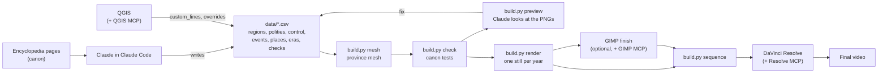

# Controglobe video studio

**"Alternate History of Arabia (in place of the United States)", every year from 500 BCE to 2026.**

This folder turns the Controglobe canon into a mapping video in the "X (in Y), every year"
style: one map per year on real coastlines, a year counter that never stops, era title cards,
short captions, music. Claude writes the history as data and drives the tools; Python draws
precise, topologically clean borders and renders every year; QGIS, GIMP and DaVinci Resolve
do the hands-on work, and Claude can operate all three through MCP servers.

It is separate from the encyclopedia: the site stays dependency-free, and nothing here is
loaded by any page. Generated files (`build/`, `output/`, `cache/`) are never committed.

## Transposition, not transplantation

| | Transplantation (the usual "X in place of Y") | Transposition (Controglobe) |
|---|---|---|
| What moves | The country: its land or its people are set down in Y's place | Only history: Arabia takes the United States' *role* |
| Coastline on screen | Y's, or X's shape pasted onto Y's location | Arabia's own, unchanged |
| Borders | Whatever X had, re-fitted | New, internal frontiers on wadis, rivers, escarpments |
| Names | X's | Arabian throughout: roles, not costumes |

What the viewer should feel is the rhyme:

| United States | Arabia in the Global Swap |
|---|---|
| Jamestown, 1607 | Red Sea Company settlement at Jeddah, 1607 |
| Georgia, the thirteenth colony, 1732 | Najd, chartered around Diriyah and Riyadh, 1732 |
| Declaration of Independence, 1776 | Declaration of 25 September 1776 |
| Treaty of Paris, frontier on the Mississippi, 1783 | Treaty of Zafar, frontier on the Euphrates, 1783 |
| Louisiana Purchase, 1803 | Kuwait Purchase: Kong sells Mesopotamia, 1803 |
| Republic of Texas, 1836-45 | Republic of Sharqiyah, 1836-45 |
| Mexican Cession, 1848 | Treaty of Ras Musandam: Masr cedes Oman, Socotra and the Gulf littoral |
| Confederate States, 1861-65 | Islamic States of Arabia, capital Riyadh |
| Alaska Purchase, 1867 | Adharbaijan bought from the Abyssinian Empire |
| Hawaii, 1898 | Qumur annexed |

## Two cuts

| Cut | Command | What it is |
|---|---|---|
| **Motion cut** (the finished video) | `python build.py motion` (`--scale 1` for 4K, `--prores` for Resolve) | A Controglobe logo sting, the premise card, a lit 3D globe that turns to Arabia and dives in, then every year with a moving camera (pans, zooms, rotation from `data/camera.csv`), crossfades on every border change, and at each era a push-in that settles, a focus pull and a sweep of the era's colour under a frosted-glass title card; animated war arrows, pulsing battles with a flash and camera shake (`data/wars.csv`), and an infobox with the Qumur inset docked at its foot: year, flag and Great Seal, head of state with portrait, term and party, events (earlier years' still on screen carry their year), population and the largest cities. Every election year holds (`pacing.election_seconds`) while its result counts up and the winner is named. After 2026 a close: the infobox slides away into a dark gradient, cinema bars close in and the years, the Union's name and its motto rise; then the map dims and the demographics follow in one continuous shot (population by state, religion and ancestry by county, the largest cities) before an end card with the logo. A soundtrack made in code runs under all of it (see Sound). |
| **Stills cut** | `render`, `sequence`, `animatic` | One still per year, to edit by hand in Resolve |

The encyclopedia's ten maps of al-Mashriq are drawn on the same borders: `python build.py
sitemaps` redraws their ground (sea depths, relief projected by QGIS, rivers, the coloured areas
and the frontiers of each map's year) from the mesh, in both editions, and leaves what each map
says (towns, arrows, labels, legend) as the page wrote it. `config/sitemaps.yaml` says which
year each map shows and which regions take which legend colour; the two maps of growth read
each region's joining year from `data/control.csv`. The same command draws the History page's
map of every year (a slider and a play button over every frontier change, with the events and
eras in both languages) and lays sea depths, relief, rivers and a crisp coast under the world
maps. `python build.py atlas` redraws the Africa and Europe atlases the same way: the
hand-drawn originals in `data/atlas/` are fitted to the real coast and their nations laid on a
mesh, so no frontier is ruled.

To YouTube: [PUBLISHING.md](PUBLISHING.md) walks through the upload (title, description and
chapters, thumbnail, subtitles, end screen, cards, visibility) and the post that tells the
mapping community about the video; the words to paste are in `output/youtube/`.

Into Resolve: a whole `build.py motion` render ends by writing the Resolve build script for
that cut and installing it in Resolve's Scripts menu; in Resolve, open a project and run
**Workspace > Scripts > cg_resolve_build**. It sets the project to 30 fps, imports the cut
and its soundtrack stems, makes a timeline with the picture on V1, the music on A1 and the
effects on A2, and marks the opening, every era and event (moved past the opening), the close
and the finale. `python build.py resolve [--media motion|sequence]` rewrites it by hand; it
works on the free edition (see Troubleshooting).

Labels never get cut. Each map's names are drawn on a layer of their own and placed on the
part of their country the camera shows, clear of the infobox and the inset (shrunk, slid or
broken onto two lines to fit, over their own land or the sea rather than a neighbour); a name
that the camera still carries toward the infobox, the inset, the frame edge, a war label or an
era card fades out before it reaches it.

The presidents' portraits, the flag and the Great Seal are the encyclopedia's own SVG artwork
(`../united-states-of-arabia.html`), rasterised at build time and again whenever the page's
drawing changes. Nabataean kings get portraits drawn in the same style, other polities
flags drawn from their colours; your own art in `assets/portraits/<key>.png` or
`assets/flags/<polity_id>.png` replaces any of them. `python build.py thumbnail` makes the
YouTube thumbnail: a USArabia countryball beside a flag map of the country, the rest of the
land darkened, and "SINCE WHEN?".

## How it fits together



| Part | Job |
|---|---|
| **Claude (Claude Code)** | Compiles canon, writes and checks the data, runs the pipeline, reviews previews, writes GIS and editing scripts, calculates pacing, drafts narration and publishing text, drives the apps through MCP |
| **Python** (`cgvideo/`) | Mesh, borders, pacing, rendering, captions, markers, chapters |
| **QGIS** | Inspect every year's shapes; draw frontiers to the kilometre |
| **GIMP** | Paper-texture finishing, flags, thumbnail |
| **DaVinci Resolve** | The edit: music, voice-over, camera moves, titles, subtitles, final render |
| **ffmpeg** | A quick animatic straight from the stills |
| **Blender** (optional) | 3D terrain or globe shots for the intro and era transitions |

## Do it on a PC

The Python pipeline runs anywhere (a cloud Claude Code session can build, check and render it).
QGIS, GIMP and Resolve are desktop applications, so the full workflow wants a Windows, macOS or
Linux machine. The steps below are for Windows 10 or 11.

### 1. Install the tools

- **Git for Windows** and **Python 3.12** (python.org installer, tick "Add python.exe to PATH").
- **QGIS** (the current long-term release, from qgis.org).
- **GIMP 3.2 or later** (the GIMP MCP server needs 3.2).
- **DaVinci Resolve** 19 or later. The free version works; Studio additionally allows scripts
  to drive it from outside.
- **uv**, which runs the MCP servers:
  `powershell -ExecutionPolicy ByPass -c "irm https://astral.sh/uv/install.ps1 | iex"`
- **Node.js LTS**, only if you use the `npx` installer for the Resolve MCP server.
- ffmpeg is optional: `requirements.txt` brings one in through `imageio-ffmpeg`
  (or `winget install Gyan.FFmpeg`).

### 2. Get the project and run it once

```powershell
git clone https://github.com/Mofferato/controglobe.git
cd controglobe\video
py -3.12 -m venv .venv
.venv\Scripts\activate
pip install -r requirements.txt
python build.py fetch          # Natural Earth coastlines, rivers and lakes (public domain)
python build.py mesh           # about 20 seconds
python build.py check          # 0 errors, all canon checks pass
python build.py preview 1776 1862 -262
```

The previews land in `output\preview`. A full run at 1920x1080 (`python build.py render
--scale 0.5`) takes a few minutes on a four-core machine; 3840x2160 takes several times that.

### 3. Install Claude Code and open the project

```powershell
irm https://claude.ai/install.ps1 | iex     # or: npm install -g @anthropic-ai/claude-code
cd controglobe\video
claude
```

Launch it **from the `video` folder** so it loads `CLAUDE.md` and `.mcp.json` from here. Pick
the most capable model with `/model`. Then paste `prompts/MASTER_PROMPT.md`.

### 4. Connect the applications (MCP servers)

Copy `.mcp.json.example` to `.mcp.json` and correct the paths; `claude mcp list` (or `/mcp`
inside a session) shows whether each one connects. Each server talks to its application, so
start the application and its plug-in first.

| Server | Install | Start it |
|---|---|---|
| **QGIS** ([nkarasiak/qgis-mcp](https://github.com/nkarasiak/qgis-mcp)) | In QGIS: Plugins > Manage and Install Plugins > "QGIS MCP" (by Nicolas Karasiak). The server needs no clone: `claude mcp add qgis -- uvx --python 3.12 --from https://github.com/nkarasiak/qgis-mcp/archive/refs/tags/v0.14.1.zip qgis-mcp-server`, with the tag matching the plugin version QGIS installed (its `diagnose` tool reports a mismatch otherwise; QGIS's plugin repository can lag the GitHub release) | Start the server from the plugin's toolbar button. Its socket speaks length-prefixed JSON, so it only works with its own server, not with jjsantos01/qgis_mcp's (that pairing connects, then every command comes back empty) |
| **GIMP** ([maorcc/gimp-mcp](https://github.com/maorcc/gimp-mcp)) | Clone it; copy `gimp-mcp-plugin.py` into `%APPDATA%\GIMP\3.2\plug-ins\gimp-mcp-plugin\`; restart GIMP | Open any image, Tools > MCP > Start MCP Server |
| **DaVinci Resolve** ([samuelgursky/davinci-resolve-mcp](https://github.com/samuelgursky/davinci-resolve-mcp)) | With Resolve open: `npx davinci-resolve-mcp setup`, or clone and `python install.py` (it writes the Claude Code entry for you) | Studio: Preferences > General > External scripting using: Local. Free: run its bridge from Workspace > Scripts |
| **Blender** ([ahujasid/blender-mcp](https://github.com/ahujasid/blender-mcp), optional) | Install its `addon.py` in Blender and enable it | 3D view sidebar > BlenderMCP > Connect |

Other MCP servers exist for each application; these are the ones the example config assumes.
Anything that overwrites work in an application, Claude asks about first (see `CLAUDE.md`).

## The workflow

Each phase has a ready prompt in `prompts/PHASE_PROMPTS.md`.

| Phase | Claude does | You do | Done when |
|---|---|---|---|
| 1 Canon digest | Extracts every dated territorial fact from the pages | Read the contradictions list | Every row cites a page |
| 2 Regions | Splits regions the canon needs, rebuilds the mesh | Glance at the previews | Every fact fits whole regions |
| 3 Control data | Writes `control.csv` era by era, adds `checks.csv` rows | Rule on anything inferred | `check` passes, previews reviewed |
| 4 Precise frontiers | Draws `custom_lines` / `overrides`, in files or in QGIS | Adjust lines in QGIS if you like | Before/after previews agree with canon |
| 5 Events and places | Captions weighted 1-3, capitals, forts, battles | Cut or add | Captions under 90 characters |
| 6 Pacing | Sets the target length, reports chapters and budgets | Choose the length | Nothing flashes by unread |
| 7 Visual QA | Contact sheet, fixes collisions, colours, slivers | Final look | Clean sheet |
| 8 Render | Full render, optional GIMP finish, sequence, animatic | Pick the music | Animatic approved |
| 9 Edit | Builds the Resolve project with markers and music | Camera moves, voice, titles, mix | Final render |
| 10 Publish | Titles, description, chapters, tags, thumbnail brief | Make the thumbnail in GIMP | Uploaded |

### Commands

| Command | What it does |
|---|---|
| `python build.py fetch` | Downloads Natural Earth land, islands, rivers, lakes, bathymetry and shaded relief (about 90 MB) into `cache/` |
| `python build.py mesh` | Builds `build/mesh.gpkg`: cells, regions, seeds, frame layers |
| `python build.py check` | Data integrity and canon tests; writes `output/qa/report.md` |
| `python build.py timeline` | `output/timeline.json`, `captions.srt`, `markers.csv`, `youtube_chapters.txt`, `narration_budget.csv`, and the upload kit in `output/youtube/` (title, description with chapters, tags, pinned comment, checklist: see [PUBLISHING.md](PUBLISHING.md)) |
| `python build.py preview 1776 -262` | Renders single years to `output/preview` |
| `python build.py sheet` | `output/qa/contact_sheet.png` of era starts and canon checks |
| `python build.py render [--from Y --to Y] [--scale 0.5] [--workers N]` | One still per year in `output/frames` |
| `python build.py sequence [--frames DIR]` | `output/sequence/frame_000001.png ...` as hard links, for Resolve |
| `python build.py animatic [--audio music.mp3]` | `output/animatic.mp4` |
| `python build.py export-gis` | `build/history.gpkg`: every polity for every span of unchanged borders |
| `python build.py motion [--scale 1] [--prores] [--from Y --to Y] [--frame N ...] [--silent]` | The finished motion cut to `output/motion/` with its soundtrack inside (stems in `output/audio/`); a slice of years; or single PNG frames for review |
| `python build.py audio [--elevenlabs]` | Remake the soundtrack and put it into the newest motion cut, as a new file (no re-render); `--elevenlabs` first fetches every effect that has no file yet |
| `python build.py thumbnail [--text ...]` | `output/thumbnail_1280x720.png` (upload this one: YouTube's size, under its 2 MB limit) and `_1920x1080.png` |
| `python build.py resolve [--media auto\|motion\|sequence]` | `output/resolve_build.lua`, installed as Workspace > Scripts > cg_resolve_build; `auto` takes the motion cut once rendered |
| `python build.py logo [--size 1024] [--site]` | The emblem as a square PNG (the Discord server icon); `--site` also redraws the encyclopedia's favicon, touch icon and masthead globe in every page |
| `python build.py sitemaps` | The encyclopedia's maps of al-Mashriq on the video's borders, the History page's map of every year, and the world maps' ground, in both editions |
| `python build.py atlas` | The Africa and Europe atlases, redrawn on the real coast with mesh frontiers, in both editions |
| `python integrations/reference/study_reference.py <url>` | Cut timings, keyframes and a contact sheet of a reference video, for private study |
| `python build.py all` | fetch, mesh, check, timeline, render, sequence, animatic |

## Precise, unique borders

Borders are never drawn year by year. Instead:

1. **A fixed cell mesh.** Voronoi cells over the land, finer in the Levant and Mesopotamia,
   with every edge roughened by deterministic midpoint displacement: organic, hand-drawn-looking
   frontiers, and never a meridian or a parallel. The coastline, the Euphrates, Tigris, Jordan,
   Orontes, Nile, Karun and Kura, and your `custom_lines` are edges too.
2. **Regions** grow from their seed points across the cells and stop at rivers and custom lines,
   which cost `barrier_penalty` times more to cross. `overrides.geojson` forces cells into a
   region where you need a frontier placed exactly.
3. **Every border is a chain of shared cell edges**, so neighbours always meet exactly: no gaps,
   no overlaps, no wobble, and a frontier that did not move is pixel-identical from one year
   to the next.
4. **Canon is tested.** `checks.csv` rows ("1812, kuwait, st_kuwait") fail the build if the map
   drifts from the encyclopedia.

To refine a frontier by hand: `python build.py export-gis`, open QGIS, run
`integrations/qgis/cg_qgis.py` in the Python console, `cg_load()`, edit
"custom_lines (edit me)" or "overrides (edit me)" with snapping on, save, then
`python build.py mesh`. `cg_year(1848)` shows any year; `cg_export(...)` renders frames with
QGIS itself if you want its cartography (a hillshade underlay, blend modes) instead.

## The data

All in `data/`, all plain CSV with `#` comments; `cgvideo/data.py` documents every file.

- `regions.csv` 150 building blocks (17 of them unclaimed fillers at the frame edge); `groups.csv` shorthand such as `@levant` or `@arabia`.
- `polities.csv` 113 polities with colour, parent (states roll up to the Union, colonies to
  their empire), kind (territories are drawn lighter, confederations hatched) and source.
- `control.csv` who holds what; later rows override earlier ones.
- `events.csv` the timeline article's dated entries; `places.csv` capitals, forts, battles.
- `eras.csv` the setting's ten eras, each a chapter with its own base pace.
- `checks.csv` canon tests.
- `rulers.csv` the 47 presidents and the Nabataean kings (canon); `parties.csv` with the
  encyclopedia's party colours; `elections.csv` (winners canon, vote shares inferred).
- `population.csv`, `cities.csv` (the fifteen largest metros, canon for 2025),
  `demographics.csv` (state split inferred to fit the canon national shares).
- `wars.csv` campaign arrows and battles; `camera.csv` the camera's keyframes.

**This is seed data.** Rows marked `inferred` (83 of 184) fill silences by analogy, for example
Kong holding Anatolia as New France held Quebec, or the founding years of eleven of the
thirteen colonies. They make the whole video render today; replace them with canon as it is
written (phase 3), and nothing inferred should be read as canon.

## The look

`config/project.yaml` holds the frame, the projection (the encyclopedia's own: azimuthal
equal-area on 46.5E 25N), pacing, colours, label thresholds, the Qumur inset, and a light
vignette. Colours follow the encyclopedia's maps where they set one. On top of the flat
colours the maps carry a cartographic finish, each part switchable under `style:`:

- **Terrain**: Natural Earth's 1/60-degree shaded relief (`SR_HR`), projected onto exactly
  the frame or plate being drawn by **QGIS** (its headless processing tool runs GDAL's warper,
  `qgis_process run gdal:warpreproject`, cubic), with a numpy resampler when QGIS is not
  installed; cached in `build/relief/`. It darkens shaded slopes and lightens lit ones under
  the borders and labels (`relief:`).
- **Sea depth**: Natural Earth's bathymetry zones (0, 200, 1000 ... 6000 m) as stepped tints,
  a lighter shelf down to a darker abyss (`bathymetry:`); lakes take the shelf colour.
- **Coasts and borders**: a soft glow on the sea side of every coast (`coast_glow:`) and a
  soft shadow under national frontiers (`border_shadow:`).
- **Labels**: letter-spaced capitals for countries (`label_tracking:`).

The encyclopedia's maps (`sitemaps`, `atlas`) stand on richer ground, drawn by
`cgvideo/terrain.py` from **ETOPO 2022** (NOAA NCEI, public domain; land and sea floor at one
arc-minute, 444 MB, downloaded to `cache/etopo/` the first time it is needed). For each map
frame **QGIS** projects the grid (`gdal:warpreproject`, averaging) and shades it from several
lights at once (`gdal:hillshade`, multidirectional, exaggerated for the frame's scale), and
**GIMP** finishes the shading with a tone curve and an unsharp mask. The sea is tinted by its true
depth on a smooth ramp, lightly shaded by the sea floor, with water lines along the coast. When
QGIS or GIMP is open with its MCP server started, the build does the work in the open
application, talking to the plug-ins' local sockets: the projected grids and shadings appear in
QGIS under *Controglobe terrain* and each finished shading opens in GIMP. Otherwise QGIS runs
headless and numpy applies the same curve and mask. Results are cached in `build/terrain/`;
delete a frame's files there to draw it again. The video still uses Natural Earth's relief; the
new terrain is ready for a revision of it.

The logo in the opening sting, on the end card and on the thumbnail is `assets/logo.png` if
you supply one (any size, square, transparent background: it is never committed); otherwise
an emblem in the style of the site's favicon, ray-cast so it stays sharp at 4K and can turn.

For the finish in Resolve, add the captions from `captions.srt` as subtitles.

## Sound

`cgvideo/audio.py` makes the whole soundtrack in code with numpy, so nothing is licensed and
nothing can be claimed on YouTube: wavetable pads, brass and a formant choir, Karplus-Strong
plucked strings (oud, harp, harpsichord, a soft piano), drums built from pitched sines and
shaped noise, whooshes shaped in the frequency domain, and a convolution reverb.

- **The score** follows the cut: a shimmer under the logo, a drone under the premise, a swell
  as the globe turns; then a band per era (`BANDS`), each in its own mode and tempo, from a
  Hijaz drone, oud and darbuka in antiquity, through a harpsichord for the age of the crowns,
  a snare march for the revolution, an ostinato for the industrial age, war drums, a cold-war
  synth arpeggio, to a brighter, building band for the modern era; a held chord with choir and
  brass under the close's title; a calm bed for the demographics; a last chord on the end card.
  A reversed-cymbal rush leads into every era.
- **The effects** fall on the cut's own cues: the logo, each line of the premise, the globe's
  turn and dive, every era card (a boom and a whoosh), major events, battles (with the flash),
  campaign arrows, each election result (a chime as the winner is named), the infobox leaving,
  the title, the finale's panel and wipes, a pop per city bubble, and the end card.
- **The mix**: the music ducks under the effects, the whole is set to about -15 LUFS with peaks
  under -1 dBFS. `output/audio/soundtrack_<key>_{music,sfx,mix}.wav` hold the two stems and the
  mix at 48 kHz; the mix goes inside the video, the stems onto their own tracks in Resolve.

Your own sound wins. `assets/audio/music.(wav|mp3|flac|m4a)` replaces the score (looped or
trimmed to the cut, faded out at the end); `assets/audio/sfx/<cue>.(wav|mp3)` replaces one kind
of effect, the cue names being the keys of `SFX` in `cgvideo/audio.py` (`era`, `battle`,
`elected`, `close_hit` ...). With an ElevenLabs account, set `ELEVENLABS_API_KEY` and run
`python build.py audio --elevenlabs`: it asks the sound-effects API for every effect that has
no file yet (the prompts are `PROMPTS` in `audio.py`), saves them there, and remakes the
soundtrack. `python build.py audio` alone remakes the soundtrack after any such change.

## Python libraries

| Library | Used for |
|---|---|
| geopandas, pyogrio | Reading Natural Earth, writing GeoPackages for QGIS |
| shapely 2 | Voronoi, noding, polygonising, unions, label points (polylabel) |
| pyproj | The azimuthal equal-area projection |
| numpy | Seeds, the ownership matrix (year x region), the film look, the whole soundtrack |
| matplotlib | Drawing each distinct map once |
| Pillow | Year counter, captions, era cards, contact sheets |
| PyYAML | The config |
| imageio-ffmpeg | A bundled ffmpeg for the animatic |
| arabic-reshaper, python-bidi (optional) | Arabic labels |

## Troubleshooting

- **`pip install` fails on geopandas**: use Python 3.11-3.13 64-bit; the wheels bundle GDAL.
- **Resolve script cannot connect**: in Studio set External scripting to Local. The free
  edition of Resolve 21.1 and later runs no Python scripts at all, so neither
  `cg_resolve_build.py` nor the Resolve MCP server can drive it. Use the Lua build instead:
  `build.py timeline` writes `output/resolve_build.lua`; copy it to
  `%APPDATA%\Blackmagic Design\DaVinci Resolve\Support\Fusion\Scripts\Utility\`, open a
  project, and run it from Workspace > Scripts; it reports in Workspace > Console. Measured on
  free 21.1.0.14, it builds the whole thing: the free edition hands menu scripts a working
  `resolve` object even though `Resolve()` returns nil there. Three limits of that edition
  shape the script: its Lua has no `io` library (no log file); script windows (Fusion's
  UIManager) are Studio-only and merely pop an upgrade prompt, so the report window is
  shown on Studio only; and an image sequence imports at 24 fps whatever the timeline runs
  at, so the script sets the clip to 30 fps before making the timeline and then checks its
  length. By hand, without scripting: a new project set to 30 fps *before* anything is
  imported; drag `output/sequence` into the Media Pool (one clip); Clip Attributes > Video
  Frame Rate 30; Create New Timeline Using Selected Clips; then right-click the timeline >
  Timelines > Import > Timeline Markers from EDL with `output/markers.edl`. On free
  Resolve 21.0 and earlier the Python script still works from that menu (set
  `CG_VIDEO_DIR` first).
- **`sequence` makes copies, not links**: the drive does not support hard links (exFAT or
  FAT32); use an NTFS drive or expect about 1 GB per 15,000 frames at 1080p.
- **A region "shares a seed cell" or "has no cells"**: two seeds are too close for the mesh;
  move one, or add a finer `focus` box in the config.
- **An MCP server shows as failed**: start its application and plug-in first, then `/mcp`.
- **Resolve shows an older cut**: Resolve keeps every file it has imported open, and remembers
  it, for as long as it runs; a new file written under an old name is not seen. So each whole
  `build.py motion` render gets its own name (`output/motion/controglobe_motion_<date-time>.mp4`)
  and the Resolve script always imports the newest. If Resolve still reports the wrong length,
  the script stops and says so: close Resolve completely, reopen it, and run the script again.
  Old cuts can be deleted once no project uses them.
- **The Resolve script says the newest cut no longer matches the timeline**: the data, the
  pacing or the cut's structure changed after that cut was rendered, so its length and markers
  would be wrong. Run `python build.py motion`; the new cut installs a matching script.
- **The soundtrack stems are not on the timeline**: a Resolve that will not place clips on
  chosen tracks from a script gets the timeline made from the cut itself, whose audio is the
  finished mix, and the Console says so. To balance music and effects by hand, drag
  `output/audio/soundtrack_<key>_music.wav` and `_sfx.wav` from the Media Pool onto two audio
  tracks at the timeline's start, and mute the cut's own audio.
- **The GIMP MCP server will not install** (`Failed to build pydantic-core`, "Python 3.14 is
  newer than PyO3's maximum"): its locked dependencies have no Python 3.14 build yet. In the
  `gimp-mcp` folder run `uv python pin 3.12` then `uv sync`; uv downloads Python 3.12 itself.
- **Tools > MCP is missing in GIMP**: GIMP only looks for new plug-ins when it starts, and
  opening it again while an old copy is still running just brings that copy back. Quit it
  with File > Quit (check Task Manager for `gimp-3`), then start it again. PhotoGIMP is fine:
  it is GIMP 3.2 with a different layout.
